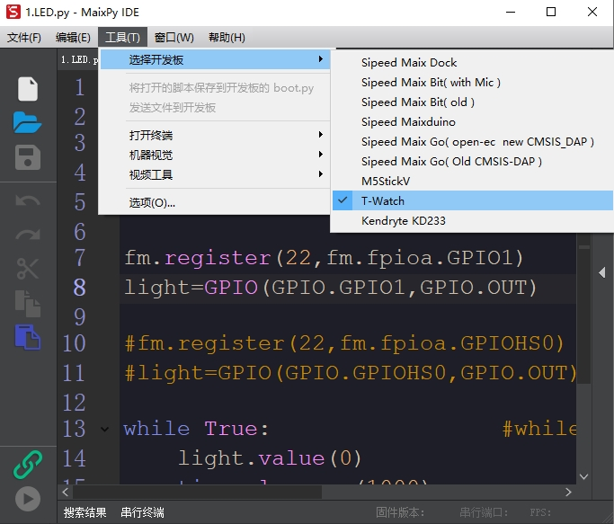

******************
入门使用篇
******************

1. MaixPy IDE
==================

.. figure:: ../_static/zza.png
   :scale: 90
   :align: center

1.1 下载IDE
~~~~~~~~~~~~~
:download:`MaixPy IDE <../download/maixpy-ide-windows-0.2.5.exe>`

1.2 操作步骤：
~~~~~~~~~~~~~~~~~
打开IDE, 上方工具栏里面选择开发板的型号.

* 选择 **工具** -> 
* 鼠标 **选择开发板** -> 
* 点击 **T-Watch**

2. 第一个程序 闪烁LED
=====================

.. code-block:: python

    import time                 #导入time，使用延时sleep
    from Maix import GPIO       #导入模块Maix的GPIO函数，分为通用和高速
    from fpioa_manager import * #导入模块fpioa_manager的全部，缩写为fm

    fm.register(22,fm.fpioa.GPIO1)    #通用GPIO0已用。故用GPIO1
    light=GPIO(GPIO.GPIO1,GPIO.OUT)   #代码默认使用通用GPIO1进行控制

    #fm.register(22,fm.fpioa.GPIOHS0) #高速GPIOHS0可用。故用GPIOHS0
    #light=GPIO(GPIO.GPIOHS0,GPIO.OUT)#当使用高速IO时，要注释掉通用IO的代码

    while True:                 #while无限循环
        light.value(0)                #设置LED低电平 灯亮
        time.sleep_ms(1000)           #延时1s
        light.value(1)                #设置LED高电平 灯灭
        time.sleep_ms(1000)           #延时1s

2.1 下载固件：
~~~~~~~~~~~~~~~~
* :download:`LED.py <../download/LED.py>`

3. T-Watch示例
=====================
.. code-block:: python

    import lcd                  #导入LCD屏幕库
    import time                 #导入time时间库
    import sensor               #导入sensor摄像头传感库
    from Maix import GPIO       #导入模块Maix的GPIO函数，分为通用和高速
    from fpioa_manager import * #导入模块fpioa_manager的全部，缩写为fm

    #开启屏幕背光，可参考开启LED灯1.LED.py 原理相同
    fm.register(board_info.PIN17,fm.fpioa.GPIO0)
    led=GPIO(GPIO.GPIO0,GPIO.OUT)
    led.value(1)                #1:开启背光 0:关闭背光

    lcd.init(freq=15000000)     #LCD屏幕初始化 运行频率15M
    lcd.rotation(2)             #LCD旋转模式设置 2:向上 0:向下 1:向左 0:向右

    sensor.reset()              #摄像头重置初始化
    sensor.set_pixformat(sensor.RGB565) #摄像头图像格式RGB565 16位/像素
    sensor.set_framesize(sensor.QVGA)   #摄像头图像帧大小QVGA
    sensor.skip_frames(time=2000)       #摄像头跳帧时间2秒 使图像稳定传输到屏幕

    while(True):                #while无限循环执行
        img = sensor.snapshot()         #摄像头获取图像数据赋值给变量img(image)
        lcd.display(img)                #LCD屏幕逐帧显示摄像头img图像
3.1 下载固件：
~~~~~~~~~~~~~~~~~

* :download:`T-Watch_Demo.py <../download/T-Watch_Demo.py>`

