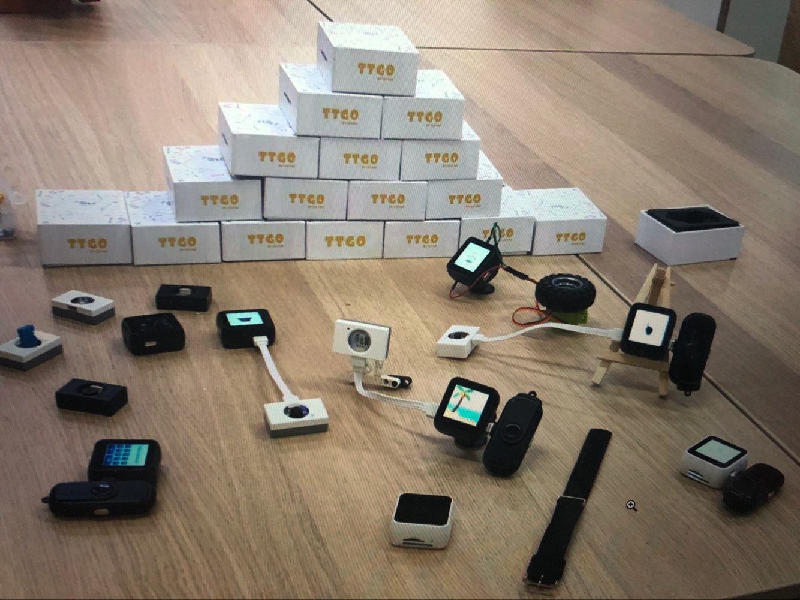
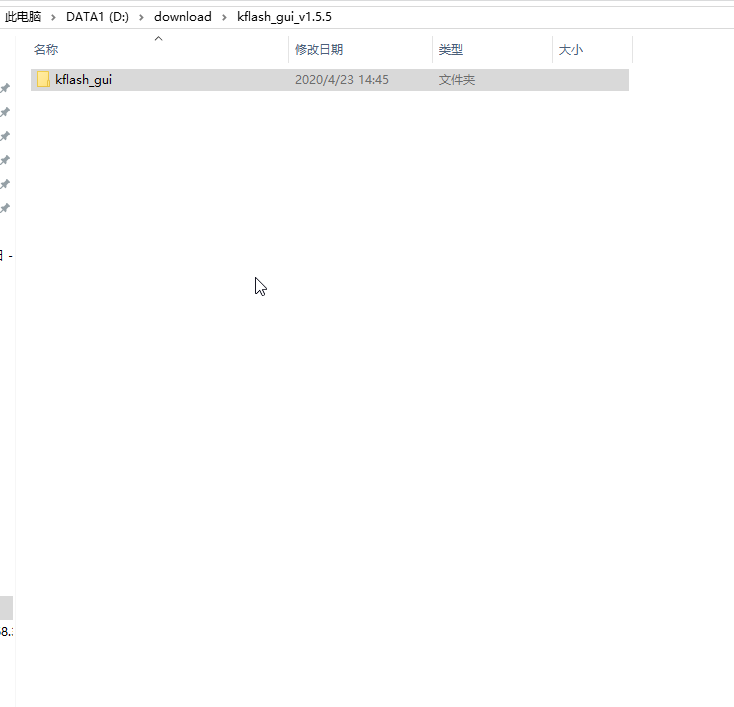
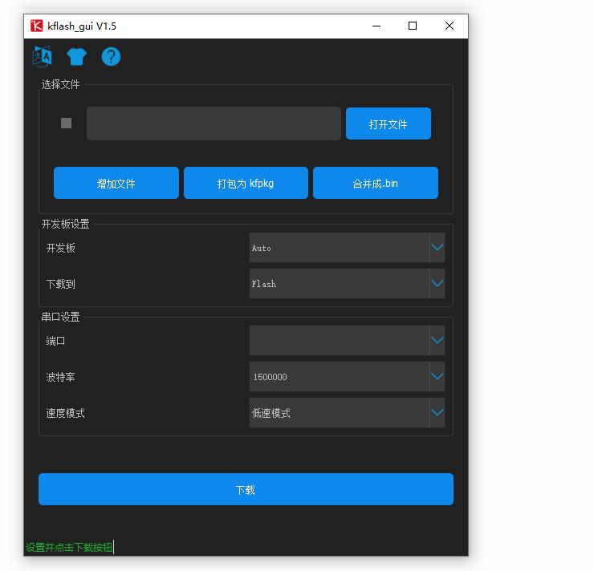

=============
快速上手
=============

本文档旨在指导用户如何使用T-Wath

恢复出厂程序
=============

设置操作环境
+++++++++++++
* :ref:`get-stared-build`
* :ref:`get-stared-config`
* :ref:`get-stared-download`
* :ref:`get-stared-use`

.. _get-stared-build:

1. 环境搭建
==============

1.1 安装CP2104驱动
++++++++++++++++++++++

* :download:`CP2104-Win10 <https://www.silabs.com/documents/public/software/CP210x_Universal_Windows_Driver.zip>`

1.2 安装下载工具IDE
+++++++++++++++++++
.. figure:: ../_static/gui1.jpg
   :scale: 100
   :align: center

下载安装包kflash_GUI: :download:`点击此处下载 <../download/kflash_gui_v1.5.5.zip>`

解压缩后 打开文件夹

.. _get-stared-config:

2. 参数介绍
==============

``kflash_GUI`` 设置操作见下：

* ``开发板``：选择Auto，自动配置
* ``下载到``：选择Flash,下载到Flash中
* ``端口``：选择自动生成的COM口
* ``波特率``：选择1500000
* ``速度模式``：选择低速

.. important::
    如果读取不到COM口，请检验驱动是否安装

.. _get-stared-download:

3. 上传固件
==============

3.1 下载出厂固件
++++++++++++++++++++++
首先下载K210固件: :download:`点击此处下载 <../download/maixpy_v0.5.0-42-g458ed4ela-twatch.bin>`

也可到 :ref:`资源下载/固件<firmware_download>` 中获取。

3.2 烧录设置
++++++++++++++++++++++

.. important::
    请等待界面左下角显示Finish（完成）时，再关闭软件。

3.3 开启烧录
++++++++++++++++++++++
.. figure:: ../_static/zz.gif
   :scale: 100
   :align: center

.. _get-stared-use:

4. 正常使用
==============

