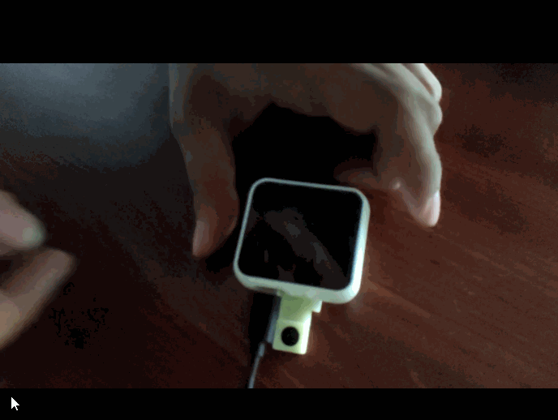

=============
快速上手
=============

恢复出厂程序
=============
本文档旨在指导用户如何烧录固件和使用

.. figure:: ../_static/dou.gif
   :scale: 90
   :align: left

.. figure:: ../_static/dou.gif
   :scale: 90
   :align: center

操作步骤
+++++++++++++
* :ref:`get-stared-build`
* :ref:`get-stared-config`
* :ref:`get-stared-download`
* :ref:`get-stared-use`

.. _get-stared-build:

1. 环境搭建
==============

1.1 安装CP2104驱动
++++++++++++++++++++++

* :download:`CP2104-Win10 <https://www.silabs.com/documents/public/software/CP210x_Universal_Windows_Driver.zip>`

1.2 安装下载工具IDE
+++++++++++++++++++
.. figure:: ../_static/gui1.jpg
   :scale: 100
   :align: center

下载安装包kflash_GUI: :download:`点击此处下载 <../download/kflash_gui_v1.5.5.zip>`

解压缩后 打开文件夹

找到kflash_gui.exe，双击即可直接打开

.. note::
    为了方便下次使用，建议把exe文件另存快捷方式到桌面。

.. _get-stared-config:

2. 参数介绍
==============

``kflash_GUI`` 设置操作见下：

* ``开发板``：选择Auto，自动配置
* ``下载到``：选择Flash,下载到Flash中
* ``端口``：选择自动生成的COM口
* ``波特率``：选择1500000
* ``速度模式``：选择低速

.. important::
    如果读取不到COM口，请检验驱动是否安装

.. _get-stared-download:

3. 上传固件
==============

3.1 下载出厂固件
++++++++++++++++++++++
首先下载K210固件: :download:`点击此处下载 <../download/maixpy_v0.5.0-42-g458ed4ela-twatch.bin>`

也可到 :ref:`资源下载/固件<firmware_download>` 中获取。

3.2 烧录设置
++++++++++++++++++++++

* ``开发板``：选择Auto，自动配置
* ``下载到``：选择Flash,下载到Flash中
* ``端口``：选择自动生成的COM口
* ``波特率``：选择1500000
* ``速度模式``：选择低速

3.3 开启烧录
++++++++++++++++++++++
.. figure:: ../_static/zz.gif
   :scale: 100
   :align: center

.. _get-stared-use:

4. 正常使用
==============

烧录成功后 会有三种模式

4.1 正常运行模式
++++++++++++++++++++

.. note::
    通电即可 屏幕界面保持不变

4.2 测试模式
++++++++++++++++++++

开启摄像显示需要进行如下操作

* ``1.接入电源``
* ``2.按住紧靠USB口的按键`` 
* ``3.看到屏幕亮起时松手``
 
.. figure:: ../_static/asd.gif
   :scale: 100
   :align: center

.. important::
    谨记要在通电之后再按按键，否则会进入上传模式

4.3 上传模式
++++++++++++++++++++

在通电前按住按键会进入上传模式
但要避免这种情况

