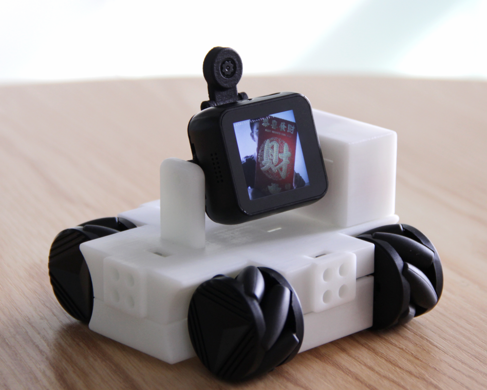

.. Arduino 编程指南 documentation master file, created by
   sphinx-quickstart on Fri Apr 19 14:10:11 2019.
   You can adapt this file completely to your liking, but it should at least
   contain the root `toctree` directive.

T-Watch K210电子文档
=====================

T-Watch-K210 可编程智能手表是深圳芯元电子最新推出的一款自主开发产品。

.. toctree::
   :hidden:
   
   简介 <introduction/index> 
   快速上手 <get-started/index>
   入门使用篇 <basics/index>
   进阶开发篇 <advanced/index>
   下载资源 <download/index>
   相关链接 <related-links/index> 

    