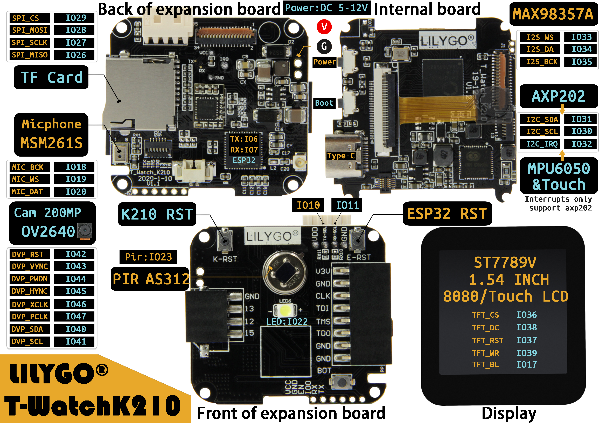

================
T-Watch K210简介
================

.. image:: ../_static/k1.jpg

1.描述
==================
T-Watch K210是一款基于K210的可编程手表套件，由三块底板及屏幕组成。
您可以通过Arduino或MicroPython对T-Watch K210进行编程。

2.硬件参数
==============
- 主芯片：**K210**
- 1.54寸电容高清显示屏：ST7789V
- 触摸板芯片：FT6236U
- 200万像素高清摄像头：OV2640 
- 三轴加速度计:BMA423
- 麦克风：MSM261S
- 扬声器：Max98357A
- PMU电源管理：AXP202
- RTC时钟模块：PCF8563
- 6轴加速度计：MPU6050
- 支持TF卡读写
- 支持可拓展模块使用
- 供电方式：Type-C USB/锂电池
  
2.1 K210
--------------
.. figure:: ../_static/i.png 
   :scale: 40
   :align: center

- **K210** 主控：

  - CPU：搭载基于 RISC-V ISA 的双核心 64 位的高性能低功耗 CPU，
  - 具备机器视觉能力
  - 具备机器听觉能力
  - 更好的低功耗视觉处理速度与准确率
  - 具备卷积人工神经网络硬件加速器 KPU，可高性能进行卷积人工神经网络运算
  - TSMC 28nm 先进制程，温度范围-40°C 到 125°C，稳定可靠
  - 支持固件加密，难以使用普通方法破解
  - 独特的可编程 IO 阵列，使产品设计更加灵活
  - 低电压，与相同处理能力的系统相比具有更低功耗
  - 3.3V/1.8V 双电压支持，无需电平转换，节约成本

.. note::

  Kendryte K210 是集成机器视觉与机器听觉能力的系统级芯片 (SoC)。使用台积电 (TSMC) 超低功
  耗的 28 纳米先进制程，具有双核 64 位处理器，拥有较好的功耗性能，稳定性与可靠性。该方案力求
  零门槛开发，可在最短时效部署于用户的产品中，赋予产品人工智能。
  Kendryte K210 定位于 AI 与 IoT 市场的 SoC，同时是使用非常方便的 MCU。

3.引脚定义
==============

3.1 屏幕
--------------
.. list-table:: 
   :widths: 15 10 20
   :header-rows: 1

   * - K210 
     - 属性
     - 描述
   * - GPIO36
     - SPI
     - TFT_CS
   * - GPIO38
     - SPI
     - TFT_DC
   * - GPIO37
     - SPI
     - TFT_RST
   * - GPIO39
     - SPI
     - TFT_WR
   * - GPIO17
     - BL
     - TFT_BL

3.2 触摸板
--------------

.. list-table:: 
   :widths: 15 10 20
   :header-rows: 1

   * - K210 
     - 属性
     - 描述
   * - GPIO31
     - I2C
     - Touch_SDA
   * - GPIO30
     - I2C
     - Touch_SCL

3.3 TF卡
--------------

.. list-table:: 
   :widths: 15 10 20
   :header-rows: 1

   * - K210 
     - 属性
     - 描述
   * - GPIO29
     - SPI
     - TF_CS
   * - GPIO28
     - SPI
     - TF_MOSI
   * - GPIO27
     - SPI
     - TF_MISO
   * - GPIO26
     - SPI
     - TF_SCLK
 
3.4 摄像头OV2640
------------------

.. list-table:: 
   :widths: 15 10 15
   :header-rows: 1

   * - K210 
     - 属性
     - 描述
   * - GPIO42
     - DVP
     - DVP_RST
   * - GPIO43
     - DVP
     - DVP_VYNC
   * - GPIO44
     - DVP
     - DVP_PWDN
   * - GPIO45
     - DVP
     - DVP_HYNC
   * - GPIO46
     - DVP
     - DVP_XCLK
   * - GPIO47
     - DVP
     - DVP_PCLK
   * - GPIO40
     - DVP
     - DVP_SDA
   * - GPIO41
     - DVP
     - DVP_SCL

3.5 麦克风MSM261S
------------------

.. list-table:: 
   :widths: 15 10 20
   :header-rows: 1

   * - K210 
     - 属性
     - 描述
   * - GPIO18
     - I2S
     - MIC_BCK
   * - GPIO19
     - I2S
     - MIC_WS
   * - GPIO20
     - I2S
     - MIC_DAT
3.6 交互芯片ESP32
------------------

.. list-table:: 
   :widths: 15 10 20
   :header-rows: 1

   * - K210 
     - 属性
     - 描述
   * - GPIO06
     - UART
     - ESP32_TX
   * - GPIO07
     - UART
     - ESP32_RX

3.7 扬声器Max98357A
----------------------

.. list-table:: 
   :widths: 15 10 20
   :header-rows: 1

   * - K210 
     - 属性
     - 描述
   * - GPIO35
     - I2S
     - MAX_BCK
   * - GPIO33
     - I2S
     - MAX_WS
   * - GPIO34
     - I2S
     - MAX_DAT

3.8 电源管理AXP202
--------------------

.. list-table:: 
   :widths: 15 10 20
   :header-rows: 1

   * - K210 
     - 属性
     - 描述
   * - GPIO31
     - I2C
     - Touch_SDA
   * - GPIO30
     - I2C
     - Touch_SCL
   * - GPIO32
     - INT
     - AXP_IRQ

3.9 六轴加速度计MPU6050
-----------------------

.. list-table:: 
   :widths: 15 10 20
   :header-rows: 1

   * - K210 
     - 属性
     - 描述
   * - GPIO31
     - I2C
     - MPU6050_SDA
   * - GPIO30
     - I2C
     - MPU6050_SCL